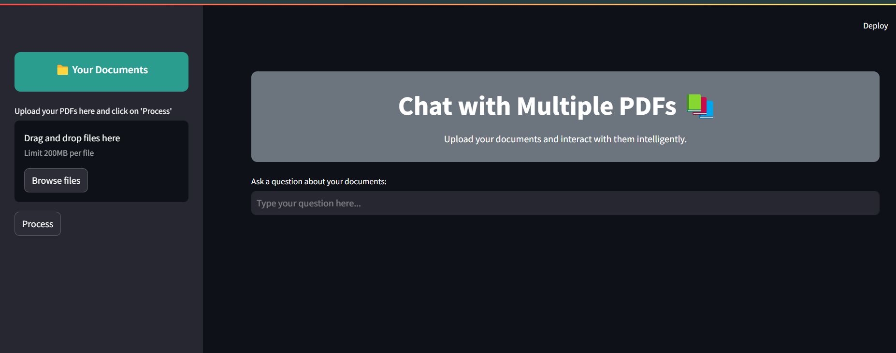
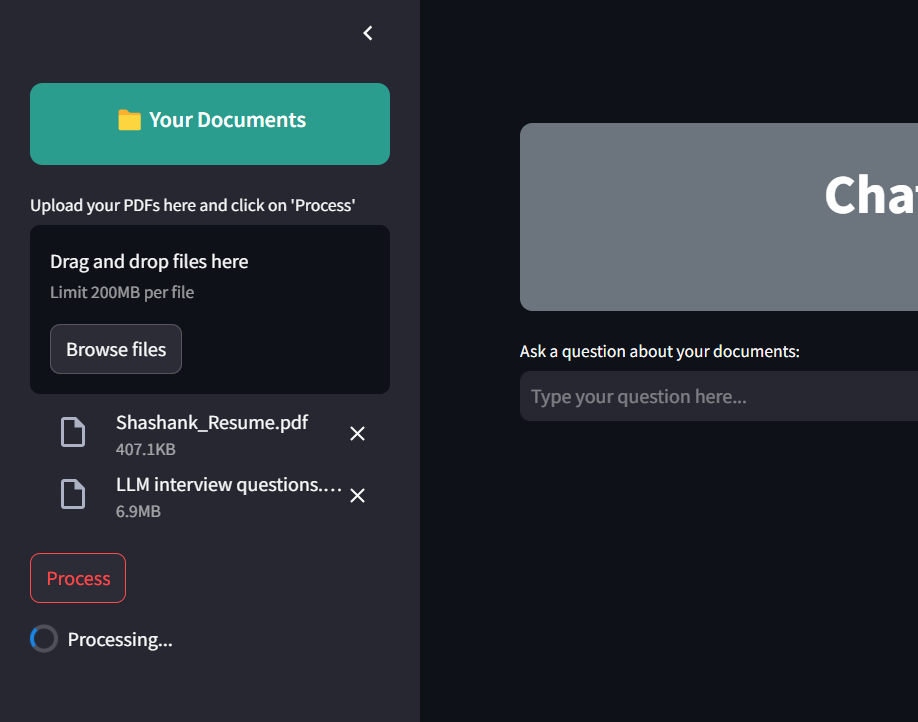
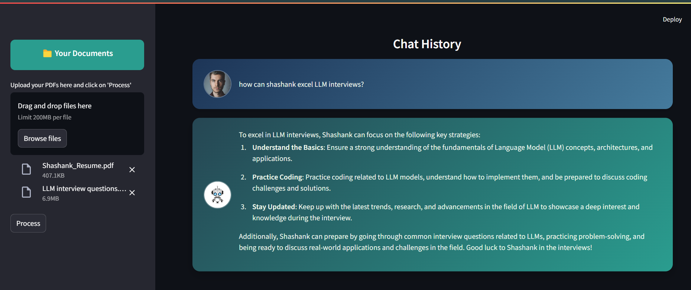

# Multiple-PDF-Chat

This project is designed to extract information from multiple PDFs and leverage **Large Language Models (LLMs)** for semantic search and question-answering. By chunking the PDF content and embedding it into a vector database, users can query the knowledge base to retrieve precise answers.

---

## Features
- **PDF Parsing**: Extracts text from uploaded PDF files.
- **Chunking**: Splits documents into smaller, manageable text chunks for processing.
- **Embedding**: Uses OpenAI's embedding model to represent chunks semantically.
- **Semantic Search**: Efficiently retrieves relevant chunks from a vector store.
- **LLM Integration**: Answers user queries by utilizing OpenAI's GPT model.

---

## Project Workflow


### Explanation of Workflow
1. **Input PDFs**: The user uploads multiple PDF files.
2. **Chunking**: The text from PDFs is divided into smaller chunks for better processing.
3. **Embedding**: Each chunk is converted into a vector representation using OpenAI embeddings.
4. **Vector Store**: These embeddings are stored in a vector database (e.g., Pinecone).
5. **Semantic Search**: The user query is embedded and compared to the stored vectors to fetch relevant chunks.
6. **Answer Generation**: The fetched chunks are passed to an LLM to generate answers for the query.

---

## Technologies Used
- **Programming Languages**: Python
- **Libraries**:
  - [LangChain](https://github.com/hwchase17/langchain): For orchestrating LLM tasks.
  - [Pinecone](https://www.pinecone.io/): For vector storage and retrieval.
  - [OpenAI](https://openai.com/): For embeddings and GPT-based LLM.
  - Streamlit: To build the web application interface.
- **Environment Management**: Python `venv` for isolated dependencies.

---

## Getting Started

### Prerequisites
- Python (>=3.8)
- OpenAI API Key

### Installation
1. Clone the repository:
   ```bash
   git clone https://github.com/charizard00001/CHAT-PDFS.git
   cd chat-pdfs
   ```

2. Create a virtual environment:
   ```bash
   python -m venv env
   source env/bin/activate # On Windows: env\Scripts\activate
   ```

3. Install dependencies:
   ```bash
   pip install -r requirements.txt
   ```

4. Add your OpenAI API Key:
   - Create a `.env` file in the root directory.
   - Add the following line:
     ```env
     OPENAI_API_KEY=your_openai_api_key_here
     ```

### Running the Application
1. Start the Flask server:
   ```bash
   streamlit run app.py
   ```
---

## Folder Structure
```
chat-pdfs/
├── __pycache__/           # Compiled Python files
├── env/                   # Virtual environment folder
├── .env                   # Environment variables
├── app.py                 # Streamlit application
├── requirements.txt       # includes all the libraries
├── htmlTemplates.py       # HTML templates for rendering web pages
├── readme.md              # readme file
```
---
## User Interface

Upload Multiple PDF files in the sidebar


Click on process to start the embedding


Ask Question related to the pdfs content


---

## Contributing
Contributions are welcome! Please open an issue or submit a pull request for any enhancements or bug fixes.

---

## License
This project is licensed under the MIT License - see the [LICENSE](LICENSE) file for details.